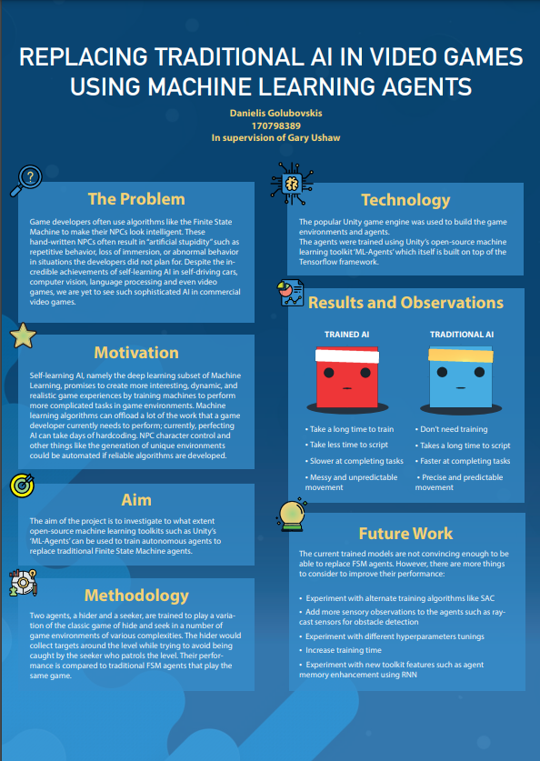

# 

  tags  
  machine learning - artificial intelligence - finite state machines - unity - video games - ml-agents - reinforcement learning  

<h1 align="center">
Replacing traditional AI in video games using Machine Learning Agents
</h1>

  Danielis Golubovskis (170798389)  
  in supervision of Dr Gary Ushaw

MComp Computer Science (Games Engineering) I610   
School of Computing, Newcastle University, Newcastle Upon Tyne, UK

Word Count: 12,161  
Date of Submission: 07-05-2021

 
 
 
 

<strong>Abstract</strong>
 
 
Self-learning AI, namely the deep learning subset of Machine Learning, promises to create more interesting, dynamic, and realistic game experiences by training machines to perform more complicated tasks in game environments. AI researchers at DeepMind, OpenAI, and more, are hard at work teaching software to play ever-more sophisticated games from classic Atari games to titles as advanced as Valve‘s Dota 2. However, despite the incredible results of such projects as OpenAI‘s ‚OpenAI Five‘, we are yet to see such sophisticated AI in commercial video games. This dissertation addresses the lack of sophisticated AI in video games and investigates the feasibility of training intelligent agents in a game environment by attempting to train agents capable of replacing traditional hard-coded AI using Unity‘s open-source machine learning toolkit. 

 
 
<strong>The Problem</strong>
 
 
Game developers often use algorithms like the Finite State Machine (FSM) to make their NPCs look intelligent. These hand-written NPCs often result in repetitive behaviour, loss of immersion, or abnormal behaviour the developers did not account for. Despite the incredible achievements of self-learning AI in self-driving cars, computer vision, language processing and even in video game environments, we don‘t see such sophisticated AI being used in commercial video games

 
 
 
<strong>Motivation</strong>
 
 
While FSMs are hard-coded, machine learning is the ability of a system to learn and improve from experience, without being explicitly programmed to do so. Machine learning algorithms can offload a lot of the work that a game developer currently needs to perform. Currently, perfecting an AI can take days of hardcoding. NPC character control and other things like the generation of unique environments could be automated if reliable algorithms are developed. The fact that machine learning has not taken over traditional AI in the video game industry made me very curious to find out what are the challenges that machine learning in video games faces.

 
 
 
<strong>Approach</strong>
 
 
Strongly inspired by OpenAI‘s paper „Emergent Tool Use from Multi-Agent Interaction“ which observed agents discovering progressively more complex tool use while playing a simple hide-and-seek game, a similar approach of training agents to play a variation of the game of hide-and-seek was chosen. Other existing projects and research papers that also attempt to train sophisticated AI in video game environments often use large-scale systems, are worked on by large teams that specialize in AI and use custom, closed source software. My approach, however, differs from these projects in several ways:
 
•	Only open-source tools are used  
•	Attempted on a much smaller scale of a single system (laptop computer)  
•	Includes scripting a FSM agent to directly compare to a trained agent  

 
 

<strong>Aims and Objectives</strong>
 
 
The project aims to investigate to what extent open-source machine learning toolkits such as Unity’s ‘ML-Agents’ can be used to train autonomous agents to replace traditional Finite State Machine agents in a game environment.
To meet my aim, I broke it down into smaller objectives and made sure they were SMART (Specific, Measurable, Achievable, Relevant, and Time-bound). The objectives are as follows:  
1.	Use online courses, published articles as well as Unity’s ML-Agents documentation to research and identify a technique for implementing the AI.  
2.	Establish a set of game rules and agent behaviours to achieve the desired ‘hide and seek’ behaviour.  
3.	Build at least 3 game level prototypes on which the training will take place.  
4.	Define a set of observable parameters for the hider and seeker agents that will be used to compare their performance to a fully scripted agent.  
5.	Build a FSM seeker, implement and train the hider and seeker agents using the rules and behaviours defined in objective 2.  
6.	Evaluate if, and to what extent the behaviours of FSM AI can be reproduced using Machine Learning agents using the observable parameters defined in objective 4.  

 
Most of the objectives are done in preparation before the implementation (objectives 1 – 4). Firstly, adequate research into AI and machine learning must be initially completed to provide an understanding of both subjects and to identify a technique to implement the AI. The purpose of the second objective is to keep the environment controlled. For example, the game of hide and seek has many variations such as standard hide and seek, team up, sardines, hotter/colder, object hunt etc. A precisely defined rule set and behaviours would eliminate any ambiguity and allow for easy replication of the game in other projects and environments. The purpose of objective 3 is to allow for broader testing on how environments may influence training while objective 4 is needed to define the parameters that would allow to directly compare agents in these environments. The fifth objective is the broadest and covers the entire implementation step from scripting to training agents. This objective depends on objective 2 and 3, however only one environment is needed to begin training, thus objective 3 can be finished during the implementation phase. As the description suggests, the final objective evaluates whether the behaviour of traditional AI NPCs can be accurately reproduced using machine learning and uses the parameters from objective 4 to do so.

 
 
 
<strong>Outcome</strong>
 
 
In the end, both the hider and seeker agents were successfully trained to play a simple game of hide and seek. While the performance of the trained agent was not up to par with the scripted agent, it could still be further improved with more training time and alternative training methods. Despite the shortcomings in performance, the trained agents took much less programming time by reusing existing code and fitting the entire code in a single script file. Unity is continuing the development of its machine learning toolkit which promises to improve training and provide access to more computational power via cloud training soon. Further information on agent performance, training, issues of machine learning and other findings will be expanded on in the appropriate chapters.

 
...... 
 
full dissertation can be downloaded from this repo

